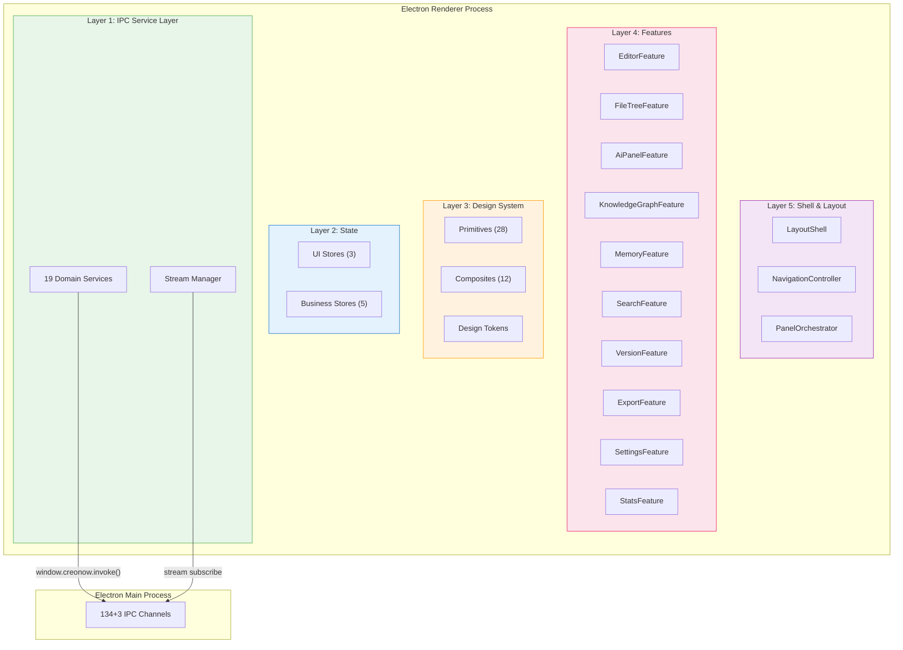

# 10.1 五层分层模型

> 来源：[docs/前端决策.md](../../前端决策.md) §5-§9、§11-§12

## 架构总览



## 依赖规则（严格单向）

- Layer 5 → Layer 4 → Layer 3 → Layer 2 → Layer 1
- **禁止反向依赖**：Layer 1 不知道 Layer 4 的存在
- **禁止跨层依赖**：Feature 不直接调用 `window.creonow.invoke()`，必须走 Service Layer
- **Layer 3 零业务逻辑**：Design System 不 import Store、不调用 Service

**量化检查点：** `dependency-cruiser` 配置上述规则，CI 中违规 = 构建失败。

## 各层概述

### Layer 1：IPC Service Layer（最底层，最先建）

新前端的地基。IPC 契约被封装为类型安全的 Service 方法，上层永远不需要知道 IPC 的存在。19 个 Service，覆盖 134+3 IPC 通道。

→ 详见 [10.3 IPC 通道](10.3-ipc-channels.md)

### Layer 2：State（Zustand 多域 Store）

UI 域与业务域分离。UI Store 3 个 + Business Store 5 个 = 8 个 Store。Store 只调用 Service Layer。

→ 详见 [10.4 状态管理](10.4-state-management.md)

### Layer 3：Design System

Primitives（28 个）+ Composites（12 个）+ Design Tokens（7 维度）。零业务逻辑。

→ 详见 [10.2 组件架构](10.2-component-architecture.md)

### Layer 4：Features（10 个业务组件）

一个 Feature = 一个文件夹。Feature 只依赖 Design System (L3) + Store (L2)。Feature 之间禁止直接 import。每个 Feature 包裹一层 ErrorBoundary。

### Layer 5：Shell & Layout

三组件拆分（AppShell 不做上帝组件）：

```
src/shell/
├── LayoutShell.tsx          # 纯布局骨架（CSS Grid）
├── NavigationController.tsx # 面板路由 + 快捷键
├── PanelOrchestrator.tsx    # 面板空间分配 + 可见性
└── App.tsx                  # 入口：Error Boundary + Provider 组合
```

**LayoutShell 的铁律：**

- 只读 `useLayoutStore`——不读任何业务 Store
- 通过 `children` / slot 接收 Feature 组件——不 import 任何 Feature
- 纯 CSS Grid + resize observer——不包含业务逻辑

## Error Boundary 架构

```tsx
// shell/App.tsx
export function App() {
  return (
    <ThemeProvider>
      <AppErrorBoundary>
        <LayoutShell>
          <EditorErrorBoundary>
            <EditorFeature />
          </EditorErrorBoundary>

          <SidebarErrorBoundary>
            <FileTreeFeature />
          </SidebarErrorBoundary>

          <PanelErrorBoundary>
            {/* 当前激活的右侧面板 */}
          </PanelErrorBoundary>
        </LayoutShell>
      </AppErrorBoundary>
    </ThemeProvider>
  )
}
```

| **Boundary** | **崩溃时行为** | **恢复策略** | **恢复时间目标** |
| --- | --- | --- | --- |
| AppErrorBoundary | "应用崩溃" + 重载按钮 | 自动尝试保存当前文档 → 重载窗口 | ≤ 3s（含保存） |
| EditorErrorBoundary | "编辑器出错" + 最近保存版本链接 | 重新初始化 TipTap，侧边栏不受影响 | ≤ 1s |
| SidebarErrorBoundary | "侧边栏加载失败" + 重试按钮 | 重新加载文件树，编辑器不受影响 | ≤ 500ms |
| PanelErrorBoundary | "面板加载失败" + 关闭按钮 | 关闭崩溃面板，其他面板不受影响 | ≤ 200ms |

## 完整目录结构

```
apps/desktop/renderer/
├── src/
│   ├── shell/                      # Layer 5: Shell
│   │   ├── App.tsx
│   │   ├── LayoutShell.tsx
│   │   ├── NavigationController.tsx
│   │   ├── PanelOrchestrator.tsx
│   │   └── error-boundaries/
│   │       ├── AppErrorBoundary.tsx
│   │       ├── EditorErrorBoundary.tsx
│   │       ├── SidebarErrorBoundary.tsx
│   │       └── PanelErrorBoundary.tsx
│   │
│   ├── features/                   # Layer 4: Features (10)
│   │   ├── editor/
│   │   ├── file-tree/
│   │   ├── ai-panel/
│   │   ├── knowledge-graph/
│   │   ├── memory/
│   │   ├── search/
│   │   ├── version/
│   │   ├── export/
│   │   ├── settings/
│   │   └── stats/
│   │
│   ├── components/                 # Layer 3: Design System
│   │   ├── primitives/ (28)
│   │   │   ├── Button.tsx
│   │   │   ├── Input.tsx
│   │   │   ├── ScrollArea.tsx       # 新增 P0
│   │   │   ├── Typography.tsx       # 新增 P0
│   │   │   ├── Surface.tsx          # 新增 P0
│   │   │   └── ...
│   │   └── composites/ (12)
│   │       ├── PanelContainer.tsx
│   │       ├── SidebarItem.tsx
│   │       ├── CommandItem.tsx
│   │       └── ...
│   │
│   ├── stores/                     # Layer 2: State (8)
│   │   ├── ui/
│   │   │   ├── themeStore.ts
│   │   │   ├── layoutStore.ts
│   │   │   └── onboardingStore.ts
│   │   └── business/
│   │       ├── projectStore.ts
│   │       ├── documentStore.ts
│   │       ├── aiStore.ts
│   │       ├── kgStore.ts
│   │       └── memoryStore.ts
│   │
│   ├── services/                   # Layer 1: IPC Service Layer (19 services, 151 channels)
│   │   ├── _bridge.ts
│   │   ├── _stream.ts
│   │   ├── ai.service.ts
│   │   ├── document.service.ts
│   │   ├── project.service.ts
│   │   └── ... (19 services total)
│   │
│   ├── styles/                     # Design Tokens + Themes
│   │   ├── tokens/ (7 维度)
│   │   ├── themes/
│   │   └── global.css
│   │
│   ├── hooks/                      # 共享 hooks（非 feature 专属）
│   │   ├── useKeyboardShortcut.ts
│   │   ├── useResizeObserver.ts
│   │   └── useDebounce.ts
│   │
│   └── main.tsx                    # 入口
│
├── index.html
├── tailwind.config.ts
├── tsconfig.json
└── vite.config.ts
```
