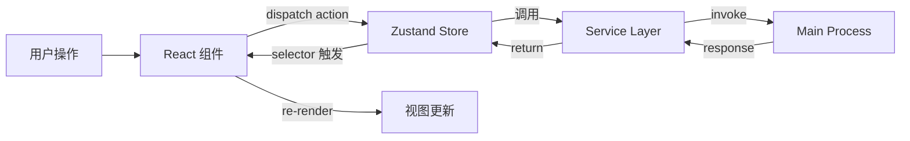

# 10.4 状态管理

> 来源：[docs/前端决策.md](../../前端决策.md) §7、[docs/CN-设计文稿.md](../../CN-设计文稿.md) §14

## 数据归属（防止职责漂移）

- **UI State（纯前端）**：布局开关、面板宽度、主题、动效偏好、临时选中态、输入框草稿等
- **业务 State（前端缓存/编排）**：当前项目/文档、加载状态、请求队列、流式订阅句柄等
- **SSOT（后端）**：文档内容与其语义层数据、KG 实体/关系、记忆条目、版本快照、搜索索引与结果

**边界目标**：让 V3 的 UI 变化只影响 Feature/Shell，而不导致数据层重写。

## 全局 Store（Zustand）

**原则：最小全局状态。** 能用 URL 参数表达的不放 Store，能用 Server State（React Query）缓存的不放 Zustand，只有真正需要跨组件共享且无法从 URL 推导的才进全局 Store。

### Store 分域

| **域** | **Store** | **职责** | **持久化** |
| --- | --- | --- | --- |
| UI | `useThemeStore` | 主题（亮/暗/跟随系统） | ✅ localStorage |
| UI | `useLayoutStore` | 面板可见性、宽度、折叠状态 | ✅ localStorage |
| UI | `useOnboardingStore` | 引导流程进度 | ✅ localStorage |
| 业务 | `useProjectStore` | 当前项目、项目列表、切换 | ❌ |
| 业务 | `useDocumentStore` | 当前文档、文档列表、排序 | ⚠️ 部分（`lastOpenDocumentId`） |
| 业务 | `useAiStore` | AI 面板状态、聊天历史、当前技能 | ❌ |
| 业务 | `useKgStore` | 知识图谱实体/关系缓存 | ❌ |
| 业务 | `useMemoryStore` | 记忆列表、蒸馏状态 | ❌ |

**合计：** UI Store 3 个 + Business Store 5 个 = **8 个 Store**

### V3 设计文稿中的 Store 字段细节

| **Store** | **状态字段** | **来源 IPC 通道** | **说明** |
| --- | --- | --- | --- |
| `useAppStore` | `isZenMode` `isFocusMode` `focusSplitRatio` `sidebarVisible` | 纯客户端状态，不持久化 | AppLayout 级别的布局状态 |
| `useProjectStore` | `currentProjectId` `currentProjectPath` `projectList` | `project:project:getcurrent` `project:project:list` | 切换项目时刷新所有依赖数据 |
| `useDocumentStore` | `currentDocumentId` `documentMeta` `saveStatus` `isDirty` | `file:document:getcurrent` `file:document:read` `file:document:save` | `saveStatus`: `idle | saving | saved | error` |
| `useAIStore` | `activeMode` `activeModelId` `activeSkillIds` `activeSessionId` `isStreaming` `runRegistry` | `ai:config:get` `ai:models:list` `skill:registry:list` `ai:chat:sessions` | `activeSkillIds`: Set\<string\>，多选 |
| `useMemoryStore` | `memorySettings` `semanticRules` `conflictQueue` | `memory:settings:get` `memory:semantic:list` | 冲突队列用于提醒 badge |

### Store 设计规则

1. **Store 只调用 Service Layer**——禁止 Store 内直接 `window.creonow.invoke()`
2. **UI Store 和 Business Store 之间最多一条边**——防止级联重渲染
3. **组件必须用 selector 订阅**——`useLayoutStore(s => s.sidebarVisible)` 而非 `useLayoutStore()`
4. **异步操作用 action 封装**——Store action 调 service，不在组件里写 async 逻辑

**量化检查点：**

- Store 单元测试覆盖率 ≥ 90%
- 每个 Store 的 selector 粒度检查：组件级 re-render 次数 ≤ 必要更新次数的 1.2 倍

## Server State（React Query）

所有 IPC 调用都包装为 React Query `useQuery` / `useMutation`：

- `useDocumentQuery(projectId, documentId)` → `file:document:read`
- `useDocumentsQuery(projectId)` → `file:document:list`
- `useProjectsQuery()` → `project:project:list`
- `useChatHistoryQuery(projectId, sessionId)` → `ai:chat:list`
- `useKGSubgraphQuery(projectId, centerId, k)` → `knowledge:query:subgraph`
- `useStatsRangeQuery(from, to)` → `stats:range:get`
- `useSkillRegistryQuery()` → `skill:registry:list`

### 缓存策略

| **数据类型** | **staleTime** | **gcTime** | **理由** |
| --- | --- | --- | --- |
| 文档列表 / 元数据 | 10s | 5min | 文件树需要相对实时 |
| 文档内容（contentJson） | 0（always fresh） | 10min | 编辑器内容是 SSOT，save 后立刻 invalidate |
| Stats / Heatmap | 60s | 30min | 统计数据变化慢 |
| AI 模型列表 | 5min | 1h | 模型列表变化极慢 |
| Skill 注册表 | 30s | 30min | 用户可能刚安装/卸载 Skill |
| KG 子图 | 30s | 5min | KG 实体在 autosave 后可能更新 |

## 页面级本地状态

| **位置** | **状态** | **理由不放全局** |
| --- | --- | --- |
| EditorPage | `editorMode` `isOutlineFixed` | 仅影响当前编辑器实例，多文档分栏时各自独立 |
| AIFab | *(无持久状态)* | FAB 固定右下角，无拖拽，无需持久化位置 |
| CommandPalette | `query` `selectedIndex` `activeCategory` | 搜索状态关闭即清空 |
| SettingsModal | `activeTab` | Tab 切换只影响 Modal 内部 |
| MultiPaneEditor | `panes` `splitRatios` | 多栏分割状态局部于编辑器 |

## 数据流

## 持久化层（SQLite via IPC）

所有持久化数据由主进程 SQLite 管理，renderer **不直接操作任何数据库**：

- **文档内容**：`file:document:save`（contentJson = TipTap JSON）
- **版本快照**：每次 save 自动或手动触发 `version:snapshot:create`
- **AI 记忆**：`memory:entry:*` / `memory:semantic:*` 全量由主进程管理
- **Skill 配置**：`skill:custom:*` / `skill:registry:toggle` 写入主进程 DB
- **UI 偏好**：通过 `context:settings:read` / `context:settings:*` 读写 `.creonow/settings.json`
