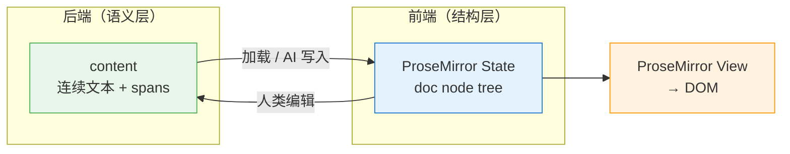

# 40.3 编辑器集成（TipTap / ProseMirror）

> **来源**：`docs/前端决策.md` §10

---

## 10.1 验收基准

| **场景** | **操作** | **延迟目标** | **测量方式** |
| --- | --- | --- | --- |
| 加载 | IPC → ProseMirror State | ≤ 200ms（1 万字） | Performance.mark |
| 输入 | 单字输入 → DOM 更新 | ≤ 16ms（一帧） | Input latency |
| AI 流式 | stream chunk → DOM | ≤ 16ms/batch（rAF） | rAF interval |
| Auto-save | ProseMirror → 语义层 save | debounce 500ms + save ≤ 100ms | Service 调用耗时 |
| AI 回滚 | EditorState 快照恢复 | ≤ 50ms | Performance.mark |

---

## 10.2 双向同步：语义层 ↔ ProseMirror



**同步规则：**

| **场景** | **数据流方向** | **机制** | **延迟目标** |
| --- | --- | --- | --- |
| 页面加载 | 后端 → 前端 | `documentService.read()` → 解析为 ProseMirror doc | ≤ 200ms |
| 人类编辑 | 前端 → 后端 | ProseMirror transaction → `documentService.save()` (debounced 500ms) | save ≤ 100ms |
| AI 流式输出 | 后端 → 前端 | stream chunk → `tr.insertText()` (batched per rAF) | ≤ 16ms/batch |
| AI 回滚 | 后端 → 前端 | rollback 通知 → 恢复 EditorState 快照 | ≤ 50ms |

---

## 10.3 AI 流式输出的 UI 策略

```tsx
// hooks/useAiStream.ts

export function useAiStream(editorView: EditorView) {
  const snapshotRef = useRef<EditorState | null>(null)
  const batchRef = useRef<string>('')
  const rafRef = useRef<number>(0)

  const flushBatch = useCallback(() => {
    if (!batchRef.current || !editorView) return

    const { tr } = editorView.state
    tr.insertText(batchRef.current, editorView.state.selection.to)
    editorView.dispatch(tr)
    batchRef.current = ''
  }, [editorView])

  const startStream = useCallback(() => {
    snapshotRef.current = editorView.state

    return createStreamSubscription({
      onChunk: (text) => {
        batchRef.current += text
        cancelAnimationFrame(rafRef.current)
        rafRef.current = requestAnimationFrame(flushBatch)
      },
      onDone: ({ rolledBack }) => {
        flushBatch()

        if (rolledBack && snapshotRef.current) {
          editorView.updateState(snapshotRef.current)
        }
        snapshotRef.current = null
      },
    })
  }, [editorView, flushBatch])

  return { startStream }
}
```

**关键性能设计：**

- **rAF 批量更新**：多个 token chunk 合并为一次 ProseMirror transaction，不逐 token 触发 DOM diff
- **快照回滚**：AI 生成前保存 EditorState，回滚时一次性恢复，不需要 undo 历史
- **背压配合**：后端发出 `ai:stream:backpressure` 时，前端降低更新频率，显示骨架动画

---

## 10.4 TipTap 自定义扩展

| **扩展** | **功能** | **优先级** | **验收标准** |
| --- | --- | --- | --- |
| `semanticSync` | ProseMirror transaction ↔ 语义层 content 双向同步 | P0（编辑器核心） | 同步丢失率 0%；round-trip 延迟 ≤ 100ms |
| `aiInline` | AI 内联补全 UI（ghost text + Tab 接受） | P1（核心体验） | ghost text 渲染 ≤ 50ms；接受/拒绝无闪烁 |
| `entityMention` | 输入 `@` 触发 KG 实体搜索并插入引用 | P2 | 搜索响应 ≤ 200ms；插入后可点击跳转 |
| `entityHighlight` | 识别到的 KG 实体高亮 + hover 卡片 | P2 | 高亮不影响编辑 FPS；hover 卡片 ≤ 150ms |
| `versionMarker` | 版本 diff 标记（插入/删除/修改区域着色） | P3 | Diff 渲染 ≤ 300ms（10 万字文档） |
| `collaborativeAnnotation` | 语义区间批注（精确到半句话） | P3 | 批注定位精度 100%（基于语义层 offset） |
