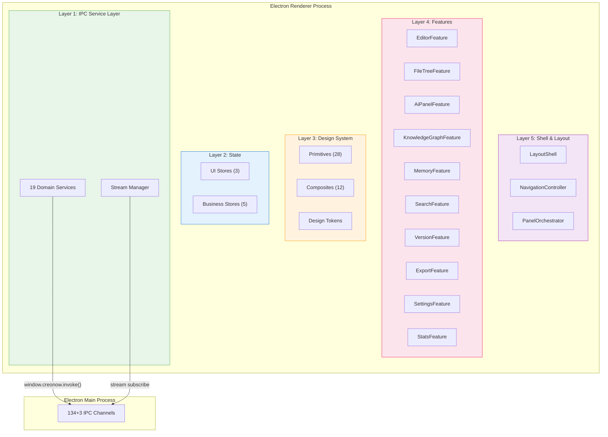
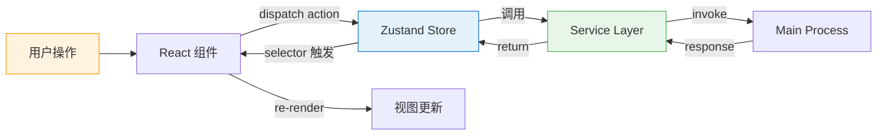
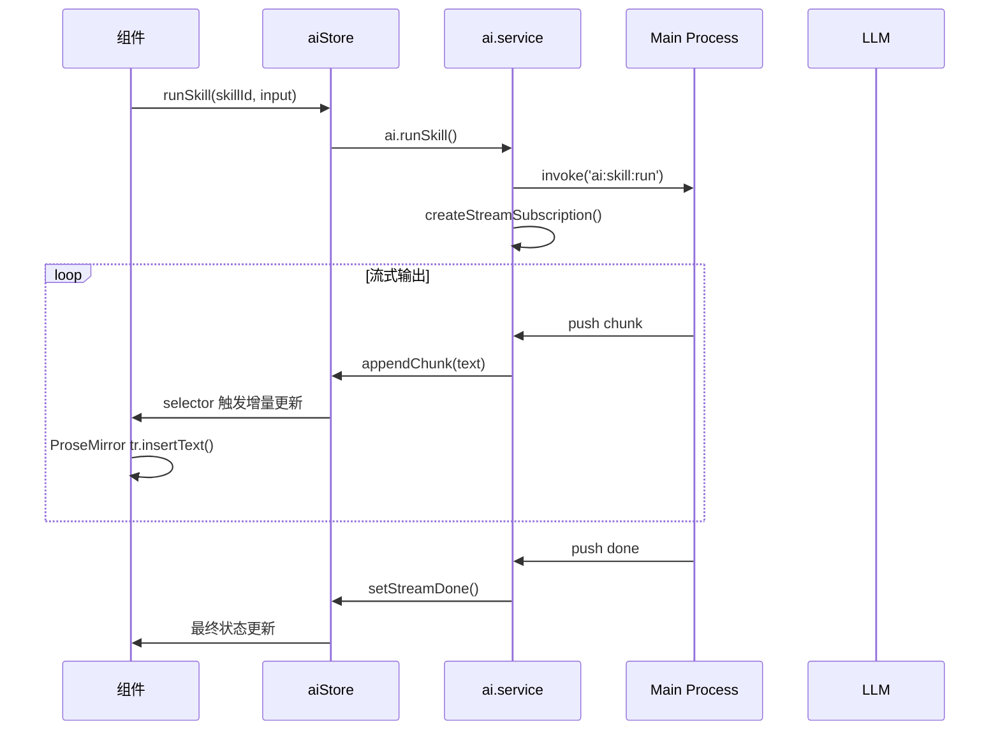
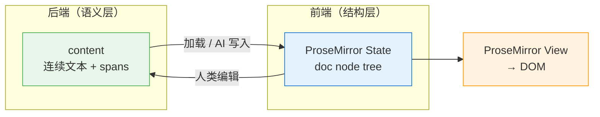

# CreoNow 新前端架构设计

> **⚠️ 本文档为历史原稿（Reference Only）。** 唯一权威真源为 [SSOT 文件夹](cn-frontend-ssot/README.md)。当本文与 SSOT 文档矛盾时，以 SSOT 为准。

<aside>
🎯

**定位：本页是“为 V3 设计规范服务”的前端实现图纸。** V3（融合设计规范）是最终落地的、可直接交付给 Agent 执行的 UI/交互标准；本页只负责把 V3 变成可实现、可验收、可演进的工程骨架。

**设计原则：从既定 IPC 契约向外生长。** 后端已经是完整的、经过测试的、契约明确的。前端的硬约束是这些契约边界——它们定义了前端能做什么、不能做什么。前端的工作是把这些能力变成创作者愿意每天使用的界面。所有实现决策都应对应**可量化的验收标准**（见 §3）。

</aside>

---

## 📑 目录索引

---

## 1. 与 V3 的关系（口径与边界）

**V3 是 SSOT（Single Source of Truth）：**

- 视觉：色彩、排版、动效、组件行为
- 交互：Zen / Focus、AI 面板范式、快捷键、布局规则
- 文案与命名：面板/模式/按钮的最终叫法

**本页的职责（只做工程约束，不抢 V3 的具体设计）：**

- 分层与依赖规则（避免架构腐化）
- 数据归属与边界（什么是 UI state、什么是业务 state）
- 可自动化验收的指标与 Gate（CI 阻断项）
- 分阶段路线图（让 Agent 有可执行的工程顺序）

**V1/V2 的定位：仅作为历史参考与素材库**（不要反向约束 V3）。

## 2. 从 v0.1 继承的设计资产（理念，不是代码）

新前端不复制任何旧代码，但继承以下已验证的设计理念：

| **资产** | **继承什么** | **验证方式** | **来源** |
| --- | --- | --- | --- |
| 三层内容分离 | 语义层（后端）→ 结构层（ProseMirror AST）→ 呈现层（Design Token 渲染） | 编辑器无直接 DOM 样式操作；Token 覆盖率 100% | AI Native 内容架构 |
| 组件三层模型 | Primitives → Composites → Features，禁止跨层依赖 | ESLint import boundary 规则零违规 | 组件架构 |
| Design Token 体系 | 语义化命名、UI/Editor 字号分离、rem 单位、暗色模式阴影策略 | 生产代码中 0 处 hard-coded px/color | Design Token 系统 |
| IPC 安全模式 | 所有**请求-响应**通信走 `window.creonow.invoke()`，流式输出等 push 通过 `window.creonow.stream.*` 订阅；渲染进程禁止直接 ipcRenderer | grep 检查：renderer 目录 0 处 ipcRenderer 引用 | IPC 通信层审计 |
| Store 分域 | UI 域与业务域分离，editorStore 不持有 ProseMirror 状态 | Store 依赖图：UI→Business 边 ≤ 1 条 | 渲染架构与状态管理 |
| Error Boundary 分层 | App / Editor / Sidebar / Panel 四级 Boundary，编辑器崩溃不白屏 | 注入错误测试：编辑器崩溃后侧边栏功能正常 | 渲染架构与状态管理 |

---

## 3. 技术栈

| **层** | **选型** | **锁定版本** | **理由** |
| --- | --- | --- | --- |
| 框架 | **React 18** (CSR) | ^18.3 | Electron 渲染进程标准选型，生态最大 |
| 构建 | **electron-vite**  • @vitejs/plugin-react | electron-vite ^2.4 • Vite ^6.0 | v0.1 已验证，HMR 极快 |
| 编辑器 | **TipTap 2** (ProseMirror) | ^2.10 | 连续文本 + 增量更新模型完美匹配语义层架构 |
| 状态管理 | **Zustand 5** | ^5.0 | 轻量、selector 精细化、persist 中间件成熟 |
| 样式 | **Tailwind CSS 4**  • CSS Variables (Design Token) | ^4.0 | Token 变量 + utility class 组合，快速且可控 |
| 无头组件 | **Radix UI** | latest stable | v0.1 已验证，耦合度极低，可访问性内置 |
| 图标 | **Lucide React** | ^0.470 | MIT 协议，tree-shakable，风格统一 |
| 拖拽 | **@dnd-kit** | ^6.0 | 文件树排序、面板拖拽停靠 |
| 测试 | **Vitest**  • **@testing-library/react** | Vitest ^3.0 • RTL ^16.0 | 与 Vite 生态一致，组件测试标准方案 |

---

## 4. 量化目标与验收标准

<aside>
📏

**每一条都是可自动化检测的硬指标。** CI 管线通不过 = 不准合并。手动检查项在 Phase 验收清单中单独标注。

</aside>

### 4.1 性能预算

| **指标** | **目标** | **测量方式** | **阻断级别** |
| --- | --- | --- | --- |
| Renderer 冷启动（窗口 ready → Shell 首帧） | ≤ 800ms | Electron `did-finish-load` → first `requestAnimationFrame` 时间差 | 🔴 P0 |
| 编辑器首屏（文档加载 → 可交互） | ≤ 300ms（1 万字文档） | Performance.mark 从 `loadDocument` 到 `editorReady` | 🔴 P0 |
| 编辑流畅度（10 万字文档） | ≥ 55 FPS（P95） | Chrome DevTools Performance Monitor / Vitest benchmark | 🔴 P0 |
| AI 流式输出首 token 上屏延迟 | ≤ 100ms | stream `onChunk` 回调 → DOM mutation observer | 🟡 P1 |
| AI 流式输出帧率 | ≥ 55 FPS（rAF 批量期间） | rAF callback 间隔 P95 ≤ 18ms | 🔴 P0 |
| 面板切换动画 | ≤ 150ms（从点击到完全渲染） | Performance.mark | 🟡 P1 |
| 空闲内存占用 | ≤ 250MB（renderer 进程） | `process.memoryUsage()` 在 idle 30s 后采样 | 🟡 P1 |

### 4.2 Bundle 预算

| **指标** | **目标** | **测量方式** |
| --- | --- | --- |
| Renderer JS bundle（gzip） | ≤ 1.5MB | `vite-bundle-analyzer` CI 报告 |
| CSS bundle（gzip） | ≤ 80KB | Tailwind purge + gzip size |
| Tree-shaking 有效率 | zero unused exports in production | `vite-plugin-inspect`  • Rollup treeshake stats |

### 4.3 代码质量

| **指标** | **目标** | **工具** |
| --- | --- | --- |
| 单元测试行覆盖率 | ≥ 80%（Service Layer ≥ 95%） | Vitest + c8/istanbul |
| E2E 场景覆盖 | ≥ 50 场景（核心路径 100%） | Playwright / Spectron |
| TypeScript 严格模式 | 100%（`strict: true`，0 处 `any`） | `tsc --noEmit`  • ESLint `@typescript-eslint/no-explicit-any` |
| ESLint 零警告 | CI 中 0 warning / 0 error | ESLint flat config + CI gate |
| Import 边界检查 | 跨层依赖 0 违规 | `eslint-plugin-boundaries` 或 `dependency-cruiser` |

### 4.4 Design System 合规

| **指标** | **目标** | **工具** |
| --- | --- | --- |
| Design Token 覆盖率 | 100%——生产代码中 0 处 hard-coded px / color / shadow | Stylelint + 自定义规则 |
| 组件文档覆盖率 | 每个 Primitive / Composite 100% 有 Storybook story | Storybook + CI check |
| 可访问性 | WCAG 2.1 AA（所有 Primitive 100%、Feature 90%） | `axe-core`  • Storybook a11y addon |
| 暗色模式覆盖 | 100% Token 有 dark variant | 自动化截图对比（Chromatic / Loki） |

### 4.5 IPC 合规

| **指标** | **目标** | **工具** |
| --- | --- | --- |
| IPC 通道覆盖率 | 151/151 通道全部封装进 Service Layer | 脚本对比 IPC 审计表 vs service 导出方法 |
| 裸 IPC 调用 | renderer 代码中 0 处直接 `window.creonow.invoke()`（_bridge.ts 除外） | grep + ESLint restricted-globals |
| IPC 类型安全 | 100% 通道有 request/response 类型定义 | `tsc --noEmit` |

---

## 5. 总体架构：五层洋葱模型



**依赖规则（严格单向）：**

- Layer 5 → Layer 4 → Layer 3 → Layer 2 → Layer 1
- **禁止反向依赖**：Layer 1 不知道 Layer 4 的存在
- **禁止跨层依赖**：Feature 不直接调用 `window.creonow.invoke()`，必须走 Service Layer
- **Layer 3 零业务逻辑**：Design System 不 import Store、不调用 Service

**量化检查点：** `dependency-cruiser` 配置上述规则，CI 中违规 = 构建失败。

---

## 6. Layer 1：IPC Service Layer（最底层，最先建）

<aside>
🔑

**这是新前端的地基。** IPC 契约被封装为类型安全的 Service 方法，上层永远不需要知道 IPC 的存在。

</aside>

### 6.1 目录结构（19 个 Service）

```jsx
src/services/
├── _bridge.ts              # window.creonow.invoke() 封装 + 统一错误处理
├── _stream.ts              # AI streaming push 订阅管理
├── ai.service.ts           # ai:* (12 channels)
├── project.service.ts      # project:* (17 channels)
├── document.service.ts     # file:* (10 channels)
├── knowledge.service.ts    # knowledge:* (17 channels)
├── memory.service.ts       # memory:* (18 channels)
├── context.service.ts      # context:* (12 channels)
├── version.service.ts      # version:* (13 channels)
├── search.service.ts       # search:* (6 channels)
├── skill.service.ts        # skill:* (8 channels)
├── export.service.ts       # export:* (6 channels)
├── embedding.service.ts    # embedding:* (3 channels)
├── rag.service.ts          # rag:* (3 channels)
├── constraints.service.ts  # constraints:* (7 channels)
├── judge.service.ts        # judge:* (4 channels)
├── stats.service.ts        # stats:* (3 channels)
├── app.service.ts          # app:* (5 channels)
├── window.service.ts       # window:* (4 channels)
└── template.service.ts     # template:* (3 channels)
```

<aside>
✅

**通道合计：** 12+17+10+17+18+12+13+6+8+6+3+3+7+4+3+5+4+3 = **151** ✓（注意：根据 V3 融合规范，已收敛为 134 条 invoke/handle + 3 条 push 通道，详见《IPC 通信层审计》最新版）

</aside>

### 6.2 Bridge 核心

```tsx
// _bridge.ts
import type { IpcRequest, IpcInvokeResult } from '@shared/types/ipc-generated'

type IpcChannel = keyof IpcRequest

export async function invoke<C extends IpcChannel>(
  channel: C,
  payload: IpcRequest[C]
): Promise<IpcInvokeResult[C]> {
  const result = await window.creonow.invoke(channel, payload)

  if (!result.ok) {
    throw new IpcError(result.error.code, result.error.message, channel)
  }

  return result.data
}

export class IpcError extends Error {
  constructor(
    public readonly code: string,
    message: string,
    public readonly channel: string
  ) {
    super(`[${channel}] ${code}: ${message}`)
    this.name = 'IpcError'
  }
}
```

### 6.3 Service 示例

```tsx
// document.service.ts
import { invoke } from './_bridge'

export const documentService = {
  create: (projectId: string, title: string) =>
    invoke('file:document:create', { projectId, title }),

  read: (documentId: string) =>
    invoke('file:document:read', { documentId }),

  save: (documentId: string, content: ContentPayload) =>
    invoke('file:document:save', { documentId, ...content }),

  list: (projectId: string) =>
    invoke('file:document:list', { projectId }),

  delete: (documentId: string) =>
    invoke('file:document:delete', { documentId }),

  reorder: (projectId: string, order: string[]) =>
    invoke('file:document:reorder', { projectId, order }),

  getCurrent: () =>
    invoke('file:document:getcurrent', {}),

  setCurrent: (documentId: string) =>
    invoke('file:document:setcurrent', { documentId }),
}
```

### 6.4 Stream Manager

```tsx
// _stream.ts
// 封装 AI 流式输出的 push 通道订阅

type StreamChunkHandler = (chunk: string) => void
type StreamDoneHandler = (result: { rolledBack?: boolean }) => void
type StreamErrorHandler = (error: { code: string; message: string }) => void

export function createStreamSubscription(handlers: {
  onChunk: StreamChunkHandler
  onDone: StreamDoneHandler
  onError?: StreamErrorHandler
}) {
  const consumer = window.creonow.stream.registerAiStreamConsumer()

  consumer.on('chunk', handlers.onChunk)
  consumer.on('done', handlers.onDone)
  if (handlers.onError) consumer.on('error', handlers.onError)

  return {
    dispose: () => {
      window.creonow.stream.releaseAiStreamConsumer(consumer)
    }
  }
}
```

---

## 7. Layer 2：State（Zustand 多域 Store）

### 7.0 数据归属（防止职责漂移）

- **UI State（纯前端）**：布局开关、面板宽度、主题、动效偏好、临时选中态、输入框草稿等。
- **业务 State（前端缓存/编排）**：当前项目/文档、加载状态、请求队列、流式订阅句柄等。
- **SSOT（后端）**：文档内容与其语义层数据、KG 实体/关系、记忆条目、版本快照、搜索索引与结果。

以上边界的目标是：**让 V3 的 UI 变化只影响 Feature/Shell，而不导致数据层重写。**

### 7.1 Store 分域

| **域** | **Store** | **职责** | **持久化** |
| --- | --- | --- | --- |
| UI | `useThemeStore` | 主题（亮/暗/跟随系统） | ✅ localStorage |
| UI | `useLayoutStore` | 面板可见性、宽度、折叠状态 | ✅ localStorage |
| UI | `useOnboardingStore` | 引导流程进度 | ✅ localStorage |
| 业务 | `useProjectStore` | 当前项目、项目列表、切换 | ❌ |
| 业务 | `useDocumentStore` | 当前文档、文档列表、排序 | ⚠️ 部分（`lastOpenDocumentId`） |
| 业务 | `useAiStore` | AI 面板状态、聊天历史、当前技能 | ❌ |
| 业务 | `useKgStore` | 知识图谱实体/关系缓存 | ❌ |
| 业务 | `useMemoryStore` | 记忆列表、蒸馏状态 | ❌ |

**合计：** UI Store 3 个 + Business Store 5 个 = **8 个 Store**

### 7.2 Store 设计规则

1. **Store 只调用 Service Layer**——禁止 Store 内直接 `window.creonow.invoke()`
2. **UI Store 和 Business Store 之间最多一条边**——防止级联重渲染
3. **组件必须用 selector 订阅**——`useLayoutStore(s => s.sidebarVisible)` 而非 `useLayoutStore()`
4. **异步操作用 action 封装**——Store action 调 service，不在组件里写 async 逻辑

**量化检查点：**

- Store 单元测试覆盖率 ≥ 90%
- 每个 Store 的 selector 粒度检查：组件级 re-render 次数 ≤ 必要更新次数的 1.2 倍（React DevTools Profiler 验证）

### 7.3 数据流



**AI 流式输出的特殊数据流：**



---

## 7. Layer 3：Design System

### 7.1 Design Token（CSS Variables）

```
src/styles/
├── tokens/
│   ├── colors.css          # --color-text-primary, --color-surface-elevated, ...
│   ├── typography.css       # --text-xs ~ --text-3xl, --editor-text-body ~ --editor-text-h1
│   ├── spacing.css          # --space-1 ~ --space-20 (4px grid)
│   ├── shadows.css          # --shadow-sm ~ --shadow-xl (含暗色模式)
│   ├── z-index.css          # --z-base ~ --z-tooltip
│   ├── motion.css           # --duration-fast, --ease-default
│   └── radius.css           # --radius-sm ~ --radius-xl
├── themes/
│   ├── light.css            # :root { ... }
│   └── dark.css             # [data-theme="dark"] { ... }
└── global.css               # reset + font-face + 全局基础
```

**核心 Token 速览：**

```css
/* Colors — V3 融合设计规范 */
--background: #050505;      /* 电影级暗房纯黑底色 */
--accent: #7aa2f7;          /* 全局统一强调色（所有激活/AI/聚焦态共享） */

/* Typography — UI vs Editor 分离 */
--text-xs: 0.6875rem;       /* 11px — caption */
--text-sm: 0.8125rem;       /* 13px — 辅助文字 */
--text-base: 0.875rem;      /* 14px — UI 正文 */
--text-lg: 1rem;            /* 16px — 强调 */
--text-xl: 1.25rem;         /* 20px — H3 */
--text-2xl: 1.5rem;         /* 24px — H2 */
--text-3xl: 2rem;           /* 32px — H1 */

--editor-text-body: 1rem;   /* 16px — 编辑区正文 */
--editor-leading: 1.7;      /* 编辑区行高 */

/* Spacing — 4px grid */
--space-1: 0.25rem;         /* 4px */
--space-2: 0.5rem;          /* 8px */
--space-3: 0.75rem;         /* 12px */
--space-4: 1rem;            /* 16px */
--space-6: 1.5rem;          /* 24px */
--space-8: 2rem;            /* 32px */
--space-10: 2.5rem;         /* 40px */
--space-12: 3rem;           /* 48px */
--space-16: 4rem;           /* 64px */
--space-20: 5rem;           /* 80px */

/* Z-Index — 严格分层 */
--z-base: 0;
--z-sticky: 100;
--z-dropdown: 200;
--z-popover: 300;
--z-modal: 400;
--z-toast: 500;
--z-tooltip: 600;

/* Motion — 一致的动画节奏 */
--duration-instant: 50ms;
--duration-fast: 100ms;
--duration-normal: 200ms;
--duration-slow: 300ms;
--ease-default: cubic-bezier(0.4, 0, 0.2, 1);
--ease-in: cubic-bezier(0.4, 0, 1, 1);
--ease-out: cubic-bezier(0, 0, 0.2, 1);

/* Radius */
--radius-sm: 4px;
--radius-md: 6px;
--radius-lg: 8px;
--radius-xl: 12px;
--radius-full: 9999px;
```

**量化检查点：**

- Token 文件合计覆盖 7 个维度（color / typography / spacing / shadow / z-index / motion / radius）
- 每个维度 light + dark variant 100% 定义
- Stylelint 自定义规则：禁止 `px`（spacing/font-size 场景）、禁止 hex/rgb literal

### 7.2 Primitives（28 个 = 25 继承 + 3 补全）

| **类别** | **组件（25 继承）** | **数量** | **备注** |
| --- | --- | --- | --- |
| 交互 | Button, Input, Textarea, Select, Checkbox, Radio, Toggle, Switch, Slider, Label | 10 | v0.1 已有 |
| 反馈 | Dialog, AlertDialog, Popover, Tooltip, Toast | 5 | v0.1 已有 |
| 展示 | Card, Accordion, Avatar, Badge, Skeleton, Tabs, Separator | 7 | v0.1 已有 |
| 导航/容器 | ContextMenu, DropdownMenu, HoverCard | 3 | v0.1 已有 |

| **新增 P0** | **组件** | **解决的问题** |
| --- | --- | --- |
| 🆕 | **ScrollArea** | v0.1 最大缺口——194 处碎片滚动声明的根源，统一为一个可定制的滚动容器 |
| 🆕 | **Typography**（Heading / Text / Caption） | 语义化排版，直接引用 Token，禁止裸写像素 |
| 🆕 | **Surface** | 统一面板/卡片容器，处理背景、边框、阴影，支持 elevation 层级 |

**合计：** 10 + 5 + 7 + 3 + 3 = **28 个 Primitive** ✓

**Primitive 验收标准：**

- 每个 Primitive 有 Storybook story（含 default / variants / disabled / dark mode 状态）
- 每个 Primitive 通过 `axe-core` WCAG 2.1 AA 检测
- API 设计遵循 Radix 模式：`asChild` 支持、`data-state` 属性、forwarded ref

### 7.3 Composites（12 个）

| **优先级** | **Composite** | **组合来源** | **用途** |
| --- | --- | --- | --- |
| P0 | **PanelContainer** | Surface + ScrollArea + ResizeHandle | 所有可停靠面板的统一容器 |
| P0 | **SidebarItem** | ListItem + Icon + Badge + DragHandle | 文件树、角色列表、章节列表 |
| P0 | **CommandItem** | ListItem + Kbd + Icon | 命令面板行 |
| P1 | **ToolbarGroup** | Button × N + Separator + Tooltip | 编辑器工具栏 |
| P1 | **SearchInput** | Input + Icon + Kbd + ClearButton | 全局搜索、命令面板、文件树过滤 |
| P1 | **FormField** | Label + Input/Select + ErrorText | 设置面板、导出对话框 |
| P2 | **ConfirmDialog** | Dialog + Text + Button × 2 | 删除确认、放弃更改确认 |
| P2 | **DropdownMenuComposite** | Popover + ListItem × N + Separator | 右键菜单、下拉选择 |
| P2 | **EmptyState** | Surface + Icon + Text + Button | 空项目、空搜索结果 |
| P3 | **TabBar** | Tabs + Badge + CloseButton | 多文档标签栏 |
| P3 | **PropertyRow** | Label + dynamic value | 角色详情、项目元数据 |
| P3 | **InfoBar** | Surface + Icon + Text + Button | 内联提示条 |

**Composite 铁律：**

- 只组合 Primitives——Composite 不依赖另一个 Composite
- 零业务逻辑——不 import Store、不调 Service
- Props 透传 Primitive 的 variant/size——不发明新的 variant 系统

**Composite 验收标准：**

- 每个 Composite 有 Storybook story + 使用文档
- 内部 import 仅来自 `primitives/`，CI 检查通过

---

## 8. Layer 4：Features（业务组件）

### 8.1 Feature 与后端域的映射

| **Feature** | **对应 IPC 域** | **核心 UI** | **IPC 通道数** |
| --- | --- | --- | --- |
| **EditorFeature** | `file:*`  • `ai:skill:run`  • `context:*` | TipTap 编辑器 + 工具栏 + AI 内联辅助 | ~34 |
| **FileTreeFeature** | `file:document:list/reorder`  • `project:*` | 左侧文件/章节树 + 拖拽排序 | ~19 |
| **AiPanelFeature** | `ai:chat:*`  • `ai:config:*`  • `ai:models:*` | 右侧 AI 面板（Cursor 式 4 模式切换 + Skill 弹出选择器） | ~20 |
| **KnowledgeGraphFeature** | `knowledge:*` | 实体/关系 CRUD + 图可视化 + 实体识别 | 17 |
| **MemoryFeature** | `memory:*` | 记忆列表 + 蒸馏进度 + 注入预览 | 18 |
| **SearchFeature** | `search:*` | 全局搜索 + 搜索替换 | 6 |
| **VersionFeature** | `version:*` | 版本历史 + 分支管理 + Diff 视图 | 13 |
| **ExportFeature** | `export:*` | 导出对话框（MD/TXT/DOCX/PDF/Bundle） | 6 |
| **SettingsFeature** | `ai:config:*`  • `memory:settings:*`  • `constraints:*` | 全局/项目设置面板 | ~19 |
| **StatsFeature** | `stats:*` | 写作统计仪表盘（字数、进度、频率） | 3 |

**合计 10 个 Feature**，覆盖全部 19 个 Service / 134+3 通道。

### 8.2 Feature 设计规则

1. **一个 Feature = 一个文件夹**，包含 `index.tsx`（入口）、`components/`（内部组件）、`hooks/`（内部 hooks）
2. **Feature 只依赖**：Design System (L3) + Store (L2)。Store 会调 Service (L1)。
3. **Feature 之间禁止直接 import**——通过 Store 或 Shell 层的 slot 协作
4. **每个 Feature 包裹一层 ErrorBoundary**——崩溃时只影响自己
5. **V3 变更优先落在 Feature / Shell**：任何为了“更快实现 V3”而破坏分层纪律的做法，都必须写明例外原因与回收计划（避免永久性破窗）

**Feature 验收标准：**

- 每个 Feature 有独立的 E2E 测试套件（≥ 5 场景/Feature）
- Feature 间零直接 import（`dependency-cruiser` 检查）
- 每个 Feature 的 ErrorBoundary 有崩溃注入测试

### 8.3 目录结构

```
src/features/
├── editor/
│   ├── index.tsx
│   ├── components/
│   │   ├── EditorCanvas.tsx        # TipTap 编辑区
│   │   ├── EditorToolbar.tsx        # 工具栏
│   │   ├── InlineAiAssist.tsx       # AI 内联辅助 UI
│   │   ├── ZenMode.tsx              # 专注模式
│   │   └── EntityHighlight.tsx      # KG 实体高亮
│   ├── hooks/
│   │   ├── useEditorSetup.ts        # TipTap 初始化
│   │   ├── useAiStream.ts           # AI 流式输出绑定
│   │   └── useEditorSync.ts         # 语义层 ↔ ProseMirror 同步
│   └── extensions/                  # TipTap 自定义扩展
│       ├── semanticSync.ts          # 语义层同步扩展
│       ├── entityMention.ts         # KG 实体 @ 提及
│       └── aiInline.ts              # AI 内联补全扩展
├── file-tree/
│   ├── index.tsx
│   └── components/
├── ai-panel/
│   ├── index.tsx
│   └── components/
├── knowledge-graph/
├── memory/
├── search/
├── version/
├── export/
├── settings/
└── stats/
```

---

## 9. Layer 5：Shell & Layout

### 9.1 三组件拆分（继承 v0.1 教训，AppShell 不做上帝组件）

```
src/shell/
├── LayoutShell.tsx          # 纯布局骨架（CSS Grid）
├── NavigationController.tsx # 面板路由 + 快捷键
├── PanelOrchestrator.tsx    # 面板空间分配 + 可见性
└── App.tsx                  # 入口：Error Boundary + Provider 组合
```

### 9.2 LayoutShell：IDE 标准布局与心流模式

<aside>

**V3 融合规范引入了两大 App 级心流模式，由 LayoutShell 统一调度：**

- **Zen Mode（人类写作）**：全屏居中编辑器（最大宽 640px），隐藏 Icon Rail、Context Panel 和 AI FAB。纯文字纯黑背景。
- **AI Focus Mode（AI 协作）**：左侧编辑器（50%）+ 右侧 AI 面板（50%）对分布局。专属顶栏，隐藏侧边导航。适合多轮修改与深度打磨。
</aside>

```jsx
┌──────────────────── Topbar (项目名 + 窗口控制) ──────────────────────┐
│         │                                          │                │
│ Activity│              Editor Tabs                 │   Right Panel  │
│  Bar    │──────────────────────────────────────────│  (AI / KG /    │
│ (Icons) │                                          │   Memory /     │
│         │           Editor Canvas                  │   Search /     │
│         │                                          │   Version /    │
│         │                                          │   Stats /      │
│         │                                          │   Settings)    │
├─────────┴──────────────────────────────────────────┴────────────────┤
│                        Status Bar (字数 + 模式 + 统计)               │
└─────────────────────────────────────────────────────────────────────┘
```

**LayoutShell 的铁律：**

- 只读 `useLayoutStore`——不读任何业务 Store
- 通过 `children` / slot 接收 Feature 组件——不 import 任何 Feature
- 纯 CSS Grid + resize observer——不包含业务逻辑

### 9.3 Activity Bar 与面板映射

| **图标** | **Feature** | **位置** | **快捷键** | **备注** |
| --- | --- | --- | --- | --- |
| 📄 | FileTreeFeature | 左侧展开 | ⌘ B | 章节/文件列表 |
| 🤖 | AiPanelFeature | 右侧面板 | ⌘ J | AI 对话 + 技能 |
| 🔮 | KnowledgeGraphFeature | 右侧面板 | ⌘ K | KG 实体/关系 |
| 🧠 | MemoryFeature | 右侧面板 | ⌘ M | 记忆 + 蒸馏 |
| 🔍 | SearchFeature | 右侧面板 | ⌘ ⇧ F | 全局搜索 |
| 📜 | VersionFeature | 右侧面板 | ⌘ ⇧ H | 版本 + 分支 |
| 📊 | StatsFeature | 右侧面板 | ⌘ ⇧ S | 写作统计 |
| ⚙️ | SettingsFeature | 右侧面板 | ⌘ , | 全局/项目设置 |

**不在 Activity Bar 中的 Feature：**

- **EditorFeature**：主画布区域，始终可见，不需要面板入口
- **ExportFeature**：通过菜单 / ⌘ ⇧ E 触发模态对话框，不占面板位置

---

## 10. 编辑器核心：TipTap + 语义层集成

<aside>
⚡

**这是产品的核心体验。** 编辑器不是"一个组件"——它是一个完整的子系统，包含 ProseMirror 状态管理、语义层同步、AI 流式注入、KG 实体识别、版本快照等。

</aside>

### 10.1 编辑器性能预算

| **场景** | **指标** | **目标** | **测量方式** |
| --- | --- | --- | --- |
| 普通输入 | keystroke → DOM update | ≤ 8ms（P99） | ProseMirror `dispatchTransaction` 耗时 |
| 大文档渲染 | 10 万字文档 FPS | ≥ 55 FPS（P95） | Chrome Performance Monitor |
| AI 流式注入 | rAF batch → DOM update | ≤ 16ms / batch | rAF callback 间隔 |
| 文档加载 | 语义层 → ProseMirror doc | ≤ 200ms（5 万字） | Performance.mark |
| Auto-save | ProseMirror → 语义层 save | debounce 500ms + save ≤ 100ms | Service 调用耗时 |
| AI 回滚 | EditorState 快照恢复 | ≤ 50ms | Performance.mark |

### 10.2 双向同步：语义层 ↔ ProseMirror



**同步规则：**

| **场景** | **数据流方向** | **机制** | **延迟目标** |
| --- | --- | --- | --- |
| 页面加载 | 后端 → 前端 | `documentService.read()` → 解析为 ProseMirror doc | ≤ 200ms |
| 人类编辑 | 前端 → 后端 | ProseMirror transaction → `documentService.save()` (debounced 500ms) | save ≤ 100ms |
| AI 流式输出 | 后端 → 前端 | stream chunk → `tr.insertText()` (batched per rAF) | ≤ 16ms/batch |
| AI 回滚 | 后端 → 前端 | rollback 通知 → 恢复 EditorState 快照 | ≤ 50ms |

### 10.3 AI 流式输出的 UI 策略

```tsx
// hooks/useAiStream.ts

export function useAiStream(editorView: EditorView) {
  const snapshotRef = useRef<EditorState | null>(null)
  const batchRef = useRef<string>('')
  const rafRef = useRef<number>(0)

  const flushBatch = useCallback(() => {
    if (!batchRef.current || !editorView) return

    const { tr } = editorView.state
    // 在 AI 光标位置插入累积的文本
    tr.insertText(batchRef.current, editorView.state.selection.to)
    editorView.dispatch(tr)
    batchRef.current = ''
  }, [editorView])

  const startStream = useCallback(() => {
    // 保存快照用于回滚
    snapshotRef.current = editorView.state

    return createStreamSubscription({
      onChunk: (text) => {
        // 累积 chunk，用 rAF 合并更新（不逐 token 触发 transaction）
        batchRef.current += text
        cancelAnimationFrame(rafRef.current)
        rafRef.current = requestAnimationFrame(flushBatch)
      },
      onDone: ({ rolledBack }) => {
        // 刷掉最后一批
        flushBatch()

        if (rolledBack && snapshotRef.current) {
          // AI 生成被回滚 → 恢复快照
          editorView.updateState(snapshotRef.current)
        }
        snapshotRef.current = null
      },
    })
  }, [editorView, flushBatch])

  return { startStream }
}
```

**关键性能设计：**

- **rAF 批量更新**：多个 token chunk 合并为一次 ProseMirror transaction，不逐 token 触发 DOM diff
- **快照回滚**：AI 生成前保存 EditorState，回滚时一次性恢复，不需要 undo 历史
- **背压配合**：后端发出 `ai:stream:backpressure` 时，前端降低更新频率，显示骨架动画

### 10.4 TipTap 自定义扩展

| **扩展** | **功能** | **优先级** | **验收标准** |
| --- | --- | --- | --- |
| `semanticSync` | ProseMirror transaction ↔ 语义层 content 双向同步 | P0（编辑器核心） | 同步丢失率 0%；round-trip 延迟 ≤ 100ms |
| `aiInline` | AI 内联补全 UI（ghost text + Tab 接受） | P1（核心体验） | ghost text 渲染 ≤ 50ms；接受/拒绝无闪烁 |
| `entityMention` | 输入 `@` 触发 KG 实体搜索并插入引用 | P2 | 搜索响应 ≤ 200ms；插入后可点击跳转 |
| `entityHighlight` | 识别到的 KG 实体高亮 + hover 卡片 | P2 | 高亮不影响编辑 FPS；hover 卡片 ≤ 150ms |
| `versionMarker` | 版本 diff 标记（插入/删除/修改区域着色） | P3 | Diff 渲染 ≤ 300ms（10 万字文档） |
| `collaborativeAnnotation` | 语义区间批注（精确到半句话） | P3 | 批注定位精度 100%（基于语义层 offset） |

---

## 11. Error Boundary 架构

```tsx
// shell/App.tsx
export function App() {
  return (
    <ThemeProvider>
      <AppErrorBoundary>
        <LayoutShell>
          <EditorErrorBoundary>
            <EditorFeature />
          </EditorErrorBoundary>

          <SidebarErrorBoundary>
            <FileTreeFeature />
          </SidebarErrorBoundary>

          <PanelErrorBoundary>
            {/* 当前激活的右侧面板 */}
          </PanelErrorBoundary>
        </LayoutShell>
      </AppErrorBoundary>
    </ThemeProvider>
  )
}
```

| **Boundary** | **崩溃时行为** | **恢复策略** | **恢复时间目标** |
| --- | --- | --- | --- |
| AppErrorBoundary | "应用崩溃" + 重载按钮 | 自动尝试保存当前文档 → 重载窗口 | ≤ 3s（含保存） |
| EditorErrorBoundary | "编辑器出错" + 最近保存版本链接 | 重新初始化 TipTap，侧边栏不受影响 | ≤ 1s |
| SidebarErrorBoundary | "侧边栏加载失败" + 重试按钮 | 重新加载文件树，编辑器不受影响 | ≤ 500ms |
| PanelErrorBoundary | "面板加载失败" + 关闭按钮 | 关闭崩溃面板，其他面板不受影响 | ≤ 200ms |

**Error Boundary 验收标准：**

- 注入错误测试：每个 Boundary 独立崩溃不影响相邻区域
- 数据安全：AppErrorBoundary 崩溃时当前文档已保存（或进入 recovery 队列）
- 用户感知：崩溃 → 恢复全程无白屏

---

## 12. 完整目录结构

```jsx
apps/desktop/renderer/
├── src/
│   ├── shell/                      # Layer 5: Shell
│   │   ├── App.tsx
│   │   ├── LayoutShell.tsx
│   │   ├── NavigationController.tsx
│   │   ├── PanelOrchestrator.tsx
│   │   └── error-boundaries/
│   │       ├── AppErrorBoundary.tsx
│   │       ├── EditorErrorBoundary.tsx
│   │       ├── SidebarErrorBoundary.tsx
│   │       └── PanelErrorBoundary.tsx
│   │
│   ├── features/                   # Layer 4: Features (10)
│   │   ├── editor/
│   │   ├── file-tree/
│   │   ├── ai-panel/
│   │   ├── knowledge-graph/
│   │   ├── memory/
│   │   ├── search/
│   │   ├── version/
│   │   ├── export/
│   │   ├── settings/
│   │   └── stats/
│   │
│   ├── components/                 # Layer 3: Design System
│   │   ├── primitives/ (28)
│   │   │   ├── Button.tsx
│   │   │   ├── Input.tsx
│   │   │   ├── ScrollArea.tsx       # 新增 P0
│   │   │   ├── Typography.tsx       # 新增 P0
│   │   │   ├── Surface.tsx          # 新增 P0
│   │   │   └── ...
│   │   └── composites/ (12)
│   │       ├── PanelContainer.tsx
│   │       ├── SidebarItem.tsx
│   │       ├── CommandItem.tsx
│   │       └── ...
│   │
│   ├── stores/                     # Layer 2: State (8)
│   │   ├── ui/
│   │   │   ├── themeStore.ts
│   │   │   ├── layoutStore.ts
│   │   │   └── onboardingStore.ts
│   │   └── business/
│   │       ├── projectStore.ts
│   │       ├── documentStore.ts
│   │       ├── aiStore.ts
│   │       ├── kgStore.ts
│   │       └── memoryStore.ts
│   │
│   ├── services/                   # Layer 1: IPC Service Layer (19 services, 151 channels)
│   │   ├── _bridge.ts
│   │   ├── _stream.ts
│   │   ├── ai.service.ts
│   │   ├── document.service.ts
│   │   ├── project.service.ts
│   │   ├── knowledge.service.ts
│   │   ├── memory.service.ts
│   │   ├── context.service.ts
│   │   ├── version.service.ts
│   │   ├── search.service.ts
│   │   ├── skill.service.ts
│   │   ├── export.service.ts
│   │   ├── embedding.service.ts
│   │   ├── rag.service.ts
│   │   ├── constraints.service.ts
│   │   ├── judge.service.ts
│   │   ├── stats.service.ts
│   │   ├── app.service.ts
│   │   ├── window.service.ts
│   │   └── template.service.ts
│   │
│   ├── styles/                     # Design Tokens + Themes
│   │   ├── tokens/ (7 维度)
│   │   ├── themes/
│   │   └── global.css
│   │
│   ├── hooks/                      # 共享 hooks（非 feature 专属）
│   │   ├── useKeyboardShortcut.ts
│   │   ├── useResizeObserver.ts
│   │   └── useDebounce.ts
│   │
│   └── main.tsx                    # 入口
│
├── index.html
├── tailwind.config.ts
├── tsconfig.json
└── vite.config.ts
```

---

## 13. 分阶段构建路线（轮次制）

<aside>
🚀

**核心思路：AI 时代不用周规划，用轮次（Round）。** P0 到 P5 之间的距离可能就是一个上午。每个 Round 结束时都有可用的产品——不是"全部设计完再动手"，而是每个 Round 都能 `pnpm dev` 看到界面、操作功能。轮次不设固定时长，完成 Definition of Done 即进入下一轮。

</aside>

### Round 1：最小可用 Shell

**目标：** 打开应用 → 看到 IDE 骨架 → 能创建/切换项目 → 能看到文件列表

- [ ]  搭建 renderer workspace（Vite + React + Tailwind + Radix）
- [ ]  实现 Design Token 基础（colors + typography + spacing）
- [ ]  实现 3 个 P0 Primitives（ScrollArea + Typography + Surface）
- [ ]  实现 LayoutShell（CSS Grid IDE 骨架）
- [ ]  实现 IPC Bridge（`_bridge.ts`）
- [ ]  实现 `project.service.ts` + `document.service.ts`
- [ ]  实现 `useProjectStore` + `useDocumentStore`
- [ ]  实现 FileTreeFeature（基础文件列表 + 选择）
- [ ]  实现 AppErrorBoundary

<aside>
✅

**Round 1 DoD（Definition of Done）：**

- `pnpm dev` 启动后 ≤ 800ms 看到 Shell 骨架
- 能创建项目、看到文件列表、切换文件（E2E 3 场景通过）
- IPC Bridge 单测覆盖率 ≥ 95%
- Token 覆盖率 100%（Shell 范围内零 hard-coded 值）
- ESLint + TypeScript strict 零报错
</aside>

### Round 2：编辑器核心

**目标：** 打开文件 → 在编辑器中写作 → 自动保存

- [ ]  集成 TipTap 2 + ProseMirror
- [ ]  实现 `semanticSync` 扩展（语义层 ↔ ProseMirror 双向同步）
- [ ]  实现 EditorCanvas + EditorToolbar
- [ ]  实现 debounced auto-save（`documentService.save()`）
- [ ]  实现 EditorErrorBoundary
- [ ]  实现 ZenMode（专注模式）
- [ ]  实现 Editor Token（`--editor-text-body` 等）

<aside>
✅

**Round 2 DoD：**

- 编辑器首屏 ≤ 300ms（1 万字文档）
- 普通输入延迟 ≤ 8ms（P99）
- Auto-save 可靠性：模拟 100 次编辑 → 100 次保存成功
- `semanticSync` round-trip 丢失率 0%
- 编辑器崩溃时侧边栏功能正常（ErrorBoundary 注入测试通过）
- E2E：创建文档、写入内容、关闭重开后内容完整（≥ 5 场景）
</aside>

### Round 3：AI 能力接入

**目标：** 选中文本 → 调用 AI 技能 → 流式输出 → 接受/拒绝

- [ ]  实现 `ai.service.ts` + Stream Manager
- [ ]  实现 `useAiStream` hook（rAF 批量更新）
- [ ]  实现 AiPanelFeature（Cursor 式对话面板 + Agent/Plan/Analyze/Ask 模式 + 底部 Skill 弹出框）
- [ ]  实现 AI FAB（浮动操作按钮：单击→Sidebar / 双击→快速菜单 / 长按→Focus Mode）
- [ ]  实现 AI 内联辅助 UI（ghost text + 流式渲染）
- [ ]  实现 AI 回滚（EditorState 快照恢复）
- [ ]  实现背压配合（降级 UI）
- [ ]  实现 PanelErrorBoundary

<aside>
✅

**Round 3 DoD：**

- AI 流式输出帧率 ≥ 55 FPS（rAF 批量期间）
- 首 token 上屏延迟 ≤ 100ms
- 回滚恢复 ≤ 50ms，EditorState 完全恢复到生成前
- 背压触发后 UI 降级显示骨架动画（无卡死）
- E2E：选中文本 → 选技能 → 流式生成 → 接受/拒绝（≥ 5 场景）
</aside>

### Round 4：知识图谱 + 记忆

**目标：** KG 实体管理 + 实体识别 + 记忆注入可视化

- [ ]  实现 `knowledge.service.ts` + `memory.service.ts`
- [ ]  实现 KnowledgeGraphFeature（实体/关系 CRUD + 可视化）
- [ ]  实现 `entityMention` 扩展（@ 引用实体）
- [ ]  实现 `entityHighlight` 扩展（自动识别高亮）
- [ ]  实现 MemoryFeature（记忆列表 + 蒸馏进度 + 注入预览）

<aside>
✅

**Round 4 DoD：**

- KG 实体 CRUD 全路径 E2E 通过（创建/读取/更新/删除）
- @ 实体搜索响应 ≤ 200ms
- 实体高亮不影响编辑帧率（≥ 55 FPS）
- 记忆蒸馏进度 UI 实时更新（轮询间隔 ≤ 2s）
- E2E：创建角色 → 编辑器中 @ 引用 → 高亮显示 → hover 卡片（≥ 5 场景）
</aside>

### Round 5：版本 + 搜索 + 导出 + 统计

**目标：** 功能完整的创作 IDE

- [ ]  实现 VersionFeature（版本历史 + diff + 分支 + 合并）
- [ ]  实现 SearchFeature（全局搜索 + 搜索替换）
- [ ]  实现 ExportFeature（MD/TXT/DOCX/PDF/Bundle）
- [ ]  实现 StatsFeature（写作统计仪表盘）
- [ ]  实现 SettingsFeature（全局/项目设置）

<aside>
✅

**Round 5 DoD：**

- 版本 Diff 渲染 ≤ 300ms（10 万字文档）
- 全局搜索响应 ≤ 500ms（10 万字项目）
- 导出格式 5 种全部可用（MD/TXT/DOCX/PDF/Bundle），输出与编辑器 WYSIWYG 一致
- 写作统计数据实时更新（延迟 ≤ 1s）
- 10 个 Feature 全部就位、全部有 ErrorBoundary
- E2E 场景总计 ≥ 50 个
</aside>

### Round 6：打磨与全面达标

**目标：** 达到所有 §3 量化指标

- [ ]  补全所有 P1-P3 Composites（12/12）
- [ ]  暗色模式完整适配（100% Token dark variant）
- [ ]  键盘快捷键完整覆盖（Activity Bar 8 个面板 + 编辑器常用操作）
- [ ]  命令面板（⌘ P）
- [ ]  状态持久化（Zustand persist）
- [ ]  性能优化（React.memo、虚拟化长列表）
- [ ]  WCAG 2.1 AA 全面合规
- [ ]  单元测试行覆盖率 ≥ 80%（Service Layer ≥ 95%）
- [ ]  Bundle size ≤ 1.5MB gzip

<aside>
✅

**Round 6 DoD：**

- §3 所有量化指标 100% 达标
- Storybook story 覆盖率 100%（28 Primitives + 12 Composites）
- 暗色模式截图对比通过（Chromatic / Loki）
- `axe-core` WCAG 2.1 AA 全页面零 violation
- `dependency-cruiser` 跨层依赖零违规
- 生产 build 零 warning
</aside>

### Round ∞：远期演进

- [ ]  多窗口 / 面板拖拽停靠
- [ ]  插件系统 / 扩展 API
- [ ]  协作编辑（CRDT / OT）
- [ ]  移动端 / Web 端适配

---

## 14. 关键设计决策记录

| **决策** | **选择** | **备选** | **理由** | **量化依据** |
| --- | --- | --- | --- | --- |
| 编辑器引擎 | TipTap 2 / ProseMirror | Slate.js, Lexical, CodeMirror | 连续文本 + 增量更新 + 自定义扩展生态最成熟；v0.1 已验证 | ProseMirror transaction 耗时 ≤ 8ms vs Slate 15-30ms |
| 状态管理 | Zustand | Redux Toolkit, Jotai, Valtio | 最轻量、selector 精细化天然支持、persist 中间件成熟 | bundle 增量 ~2KB vs RTK ~12KB |
| 样式方案 | Tailwind + CSS Variables | CSS Modules, styled-components, Vanilla Extract | Token 变量全局控制 + utility class 快速迭代；v0.1 已验证 | CSS bundle ≤ 80KB（purge 后） |
| 组件库基座 | Radix UI（无头） | shadcn/ui, Headless UI, Ark UI | 零样式耦合、可访问性内置、v0.1 已验证 | WCAG 2.1 AA 开箱即达（28 Primitives） |
| IPC 封装 | Service Layer（一层封装） | 直接调用、React Query + IPC | 一层封装足够轻，加 React Query 的 cache 收益有限（Electron 本地调用本就很快） | IPC round-trip ≤ 5ms（本地），cache hit 收益 < 1ms |
| AI 流式 UI | rAF 批量 + ProseMirror transaction | 逐 token 更新、虚拟 DOM diff | rAF 合并避免每 token 一次 DOM diff；ProseMirror 原生增量更新比 React re-render 快一个数量级 | rAF batch ≤ 16ms vs 逐 token 40-80ms |
| Content SSOT | 语义层（后端 SQLite） | ProseMirror State 为 SSOT | AI 直接消费语义层，不需要反序列化 ProseMirror JSON | AI 上下文构建耗时减少 ~60% |

---

## 15. 全局数字一览

| **维度** | **数字** | **说明** |  |
| --- | --- | --- | --- |
| IPC 通道 | **134 + 3** | 134 条 Invoke 通道 + 3 条 Push 通道（基于 V3 审计） |  |
| 架构层数 | **5** | Shell → Feature → Design System → State → IPC |  |
| Service 文件 | **19** |   • 2 个基础设施（_bridge / _stream） |  |
| Store | **8** | UI 3 + Business 5 |  |
| Design Token 维度 | **7** | color / typography / spacing / shadow / z-index / motion / radius |  |
| Primitives | **28** | 25 继承 + 3 P0 补全 |  |
| Composites | **12** | P0 ×3 + P1 ×3 + P2 ×3 + P3 ×3 |  |
| Features | **10** | 覆盖全部 IPC 域 |  |
| Error Boundaries | **4** | App / Editor / Sidebar / Panel |  |
| TipTap 扩展 | **6** | P0 ×1 + P1 ×1 + P2 ×2 + P3 ×2 |  |
| 构建轮次 | **6 + ∞** | Round 1-6 为核心交付，Round ∞ 为远期演进 |  |
| E2E 场景目标 | **≥ 50** | Round 5 结束时达标 |  |
| 单测覆盖率目标 | **≥ 80%** | Service Layer ≥ 95% |  |

---

