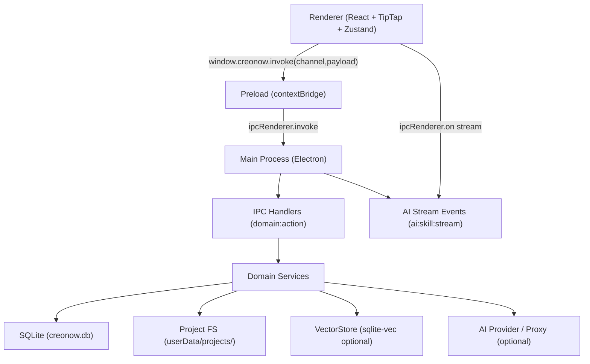

# 00 - Overview（能力地图 / 里程碑 / 风险与降级）

> 上游规范：`openspec/specs/creonow-v1-workbench/spec.md`（见：`CNWB-REQ-001/010/040/120`）

## 0. 本章目标

- 固化 CN V1 Workbench 的**系统边界**与**能力地图**（按可实现模块拆分）。
- 给实现 Agent 一张“从 0 到可交付”的**里程碑与依赖图**。
- 预先写死 Windows-first 的主要风险点与降级策略，避免实现阶段反复返工。

---

## 1. 系统能力地图（按域）

> 说明：IPC domain 既是能力分区，也是任务拆分的天然边界（避免“到处散落的一团逻辑”）。

| Domain              | 能力                                                          | 关键规范                                               |
| ------------------- | ------------------------------------------------------------- | ------------------------------------------------------ |
| `project:*`         | 项目生命周期（create/list/setCurrent/delete）+ rootPath       | `CNWB-REQ-001`、`design/04-context-engineering.md`     |
| `file:*`            | 文件/文档 IO（create/read/write/delete/list）+ session status | `CNWB-REQ-020/030`、`design/02-document-model-ssot.md` |
| `version:*`         | snapshot/diff/restore（actor=user/ai/auto）                   | `CNWB-REQ-030`                                         |
| `ai:*`              | skill run / stream / cancel / feedback + apply                | `CNWB-REQ-050`、`design/09-ai-runtime-and-network.md`  |
| `context:creonow:*` | `.creonow` ensure/watch + rules/settings/conversations        | `CNWB-REQ-060`、`design/04-context-engineering.md`     |
| `memory:*`          | CRUD + settings + injection preview + preference ingest       | `CNWB-REQ-070`、`design/05-memory-system.md`           |
| `skill:*`           | package loader + validator + list/toggle/read/write           | `CNWB-REQ-080`、`design/06-skill-system.md`            |
| `kg:*`              | entities/relations CRUD + graph:get                           | `CNWB-REQ-090`、`design/08-knowledge-graph.md`         |
| `search:*`          | FTS5 fulltext + semantic                                      | `CNWB-REQ-100`、`design/07-search-embedding-rag.md`    |
| `embedding:*`       | encode/index（本地或代理）                                    | `CNWB-REQ-100`                                         |
| `rag:*`             | retrieve（预算/分页/证据）                                    | `CNWB-REQ-100`                                         |
| `constraints:*`     | get/set 写作约束                                              | `CNWB-REQ-110`                                         |
| `judge:*`           | model ensure/state + l2 prompt                                | `CNWB-REQ-110`                                         |
| `settings:*`        | app settings（不含 secret）                                   | `CNWB-REQ-040`                                         |
| `clipboard:*`       | writeText/writeHtml                                           | `CNWB-REQ-040`                                         |

---

## 2. 端到端架构（Windows-first）

### 2.1 单链路原则（禁止双栈并存）

- 任何一个能力域在同一版本 MUST 只有一条实现链路（例如 AI：要么直连 provider，要么走 proxy；不得“先直连失败再走 proxy”）。
- 任何迁移必须以“替换 + 删除旧路径”收口（在 task card 中写清 remove-by）。

---

## 3. 里程碑（建议 = P0 执行顺序）

> 注：每个里程碑都必须同时满足：可跑测试（尤其 Windows E2E）+ 可观测证据（logs/trace）。

| Milestone     | 交付物（最小）                                                                         | 质量门禁                                   |
| ------------- | -------------------------------------------------------------------------------------- | ------------------------------------------ |
| M0 地基       | electron-vite 基础可启动；Playwright Electron E2E 骨架；Windows CI job；build:win 产物 | `windows-latest` 通过 E2E + build          |
| M1 契约       | IPC contract SSOT + types codegen；renderer typed invoke；错误码字典                   | contract:check 通过；最小 invoke E2E       |
| M2 文档闭环   | TipTap 编辑器 SSOT（JSON）；autosave 状态；file/version 基础；DB migrations            | E2E：创建→编辑→已保存→重启恢复             |
| M3 AI Runtime | stream/cancel/timeout；Fake AI server；diff+apply（最小闭环）                          | E2E：success/cancel/timeout/upstream-error |
| M4 Context    | `.creonow` ensure/watch；context viewer；redaction；stablePrefixHash 验收              | E2E：watch 生效 + redaction 断言           |
| M5 Memory     | CRUD + settings + injection preview + preference learning                              | E2E：阈值触发 learned memory               |
| M6 Skills     | package loader + validator；list/toggle；AI Panel skills popup + Cmd 入口              | E2E：禁用 skill 后不可运行                 |
| M7 KG         | kg schema + CRUD + graph view；context integration                                     | E2E：KG 内容进入 context viewer            |
| M8 Search/RAG | FTS + semantic + rag retrieve（含降级）                                                | E2E：retrieved layer 可视化                |
| M9 Judge      | model ensure/state + constraints 面板                                                  | E2E：可测降级或真实 ensure                 |

---

## 4. 风险清单与降级策略（必须提前写死）

| 风险点                                 | Windows-first 影响                      | 必须的降级/兜底                                               | 可观测证据                               |
| -------------------------------------- | --------------------------------------- | ------------------------------------------------------------- | ---------------------------------------- |
| `better-sqlite3` / native `.node` 打包 | Windows 安装/asar 打包常见失败点        | `asarUnpack` 明确列出；CI build:win 作为门禁                  | build artifact + main.log 启动证据       |
| `sqlite-vec` 扩展不可用                | semantic search / memory vec 可能不可用 | 必须降级到确定性排序或 FTS；不得阻断 AI/skills                | 日志：`vectorStore.disabled(reason=...)` |
| Embedding 模型不可用                   | semantic search 无法运行                | 返回 `MODEL_NOT_READY` + UI 可恢复引导；E2E 用 fake embedding | IPC 错误码 + UI banner + trace           |
| 文件 watch 不稳定                      | context 自动刷新失败                    | 提供手动刷新；watch 失败必须可诊断                            | `context.watch.state` + errors[]         |
| AI provider / network 不可用           | CI/E2E 不可依赖真实网络                 | Fake AI server/Proxy 为默认 E2E 路径                          | E2E 中断言 fake 命中与错误分支           |

---

## 5. 对实现 Agent 的硬要求（来自本规范的落点）

- IPC：所有 handler 返回 `IpcResponse<T>`（`ok: true|false`），禁止抛异常穿透（见 `design/03-ipc-contract-and-errors.md`）。
- UI：必须提供稳定 `data-testid`（见 `design/01-frontend-implementation.md`）。
- E2E：每个用例必须隔离 `CREONOW_USER_DATA_DIR`，且断言日志/DB/文件证据（见 `design/10-windows-build-and-e2e.md`）。

---

## Reference (WriteNow)

参考路径（用于提炼语义与可测模式）：

- `WriteNow/openspec/specs/api-contract/spec.md`
- `WriteNow/openspec/specs/sprint-write-mode-ide/spec.md`
- `WriteNow/tests/e2e/app-launch.spec.ts`
- `WriteNow/tests/e2e/sprint-2.5-context-engineering-context-viewer.spec.ts`
- `WriteNow/electron/ipc/contract/ipc-contract.cjs`

从 WN 借鉴并迁移到 CN 的关键约束（摘要）：

- IPC 必须 Envelope 化（`ok/data` vs `ok/error`）+ 稳定错误码；错误必须可测试、可诊断。
- E2E 必须真实启动 Electron，并通过 `userDataDir` 隔离 + DB 表断言 + log 证据断言建立“最低成本可回归”的门禁。
- 稳定前缀（stablePrefixHash）的验收必须可自动化：只改动态 userContent，不得影响 stable prefix。
